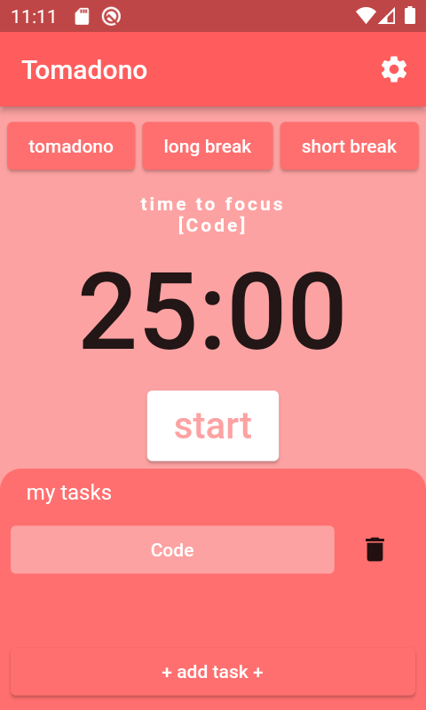
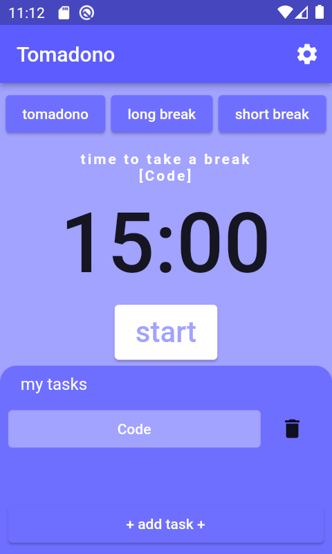
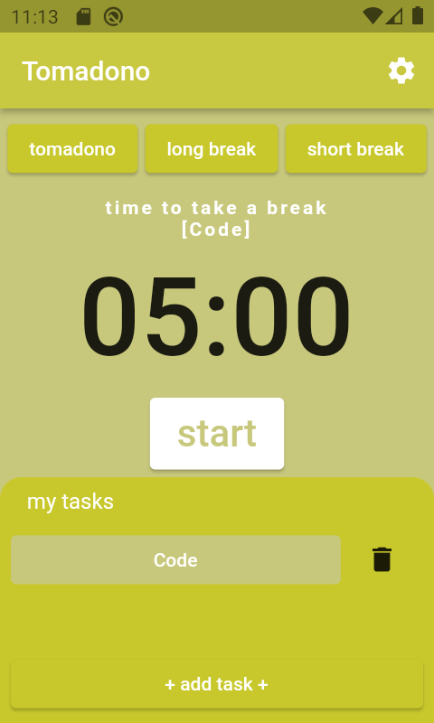
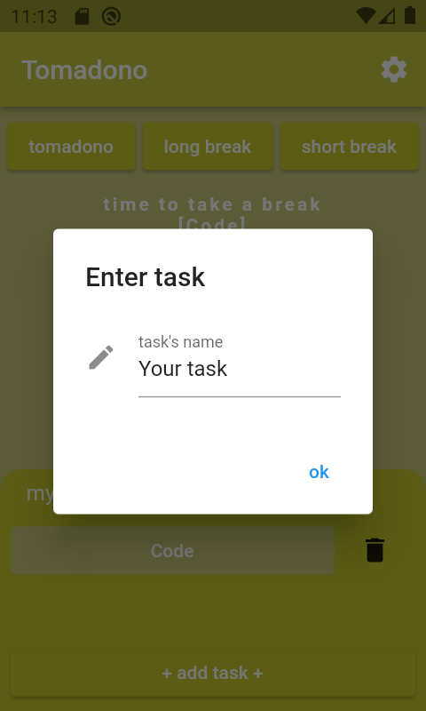
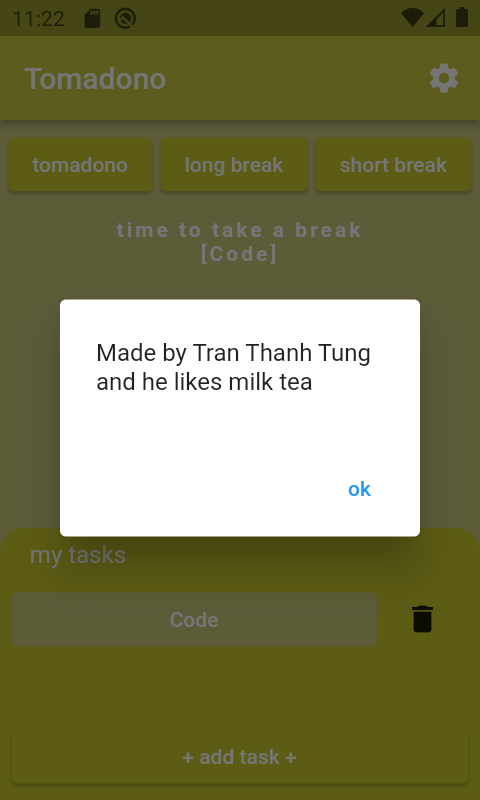

# tomadono

A Pomodoro clone
Toma = tomato
dono = master (japanese)

## Getting Started
- 3 mode: tomadono (for working), short break and long break
- 3 short break -> 1 long break

## Screenshots

  
   
  
  
  

